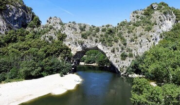
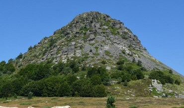

<section>

## L'Ardèche, un territoire authentique et des lieux d'exception à découvrir.

Je vous propose de découvrir ma belle région, à la nature préservée et aux
paysages magnifiques. L'Ardèche est riche d'un patrimoine remarquable, mais pas
toujours connu du grand public. Notre département a cependant la chance de
disposer d'un des joyaux de l'humanité, la **Grotte Chauvet**. A travers l'espace
de restitution de "La Grotte Chauvet 2", c'est l'occasion de donner un coup de
projecteur à l'ensemble de la culture et du tourisme ardéchois.

* Le riche patrimoine naturel du territoire et ses sites remarquables.
* Les villages d'Ardèche : des lieux chargés d'histoire, à visiter absolument !
  Découvrez les villages de Caractère d'Ardèche, aux richesses patrimoniales,
  architecturales et paysagères.
* Plus d'une trentaine de sites touristiques et culturels à découvrir : grottes,
  parcs animaliers, sites archéologiques, musées, châteaux...

[Visiter l'Ardèche](#visites)

</section>

<section id="photos">

## Cartes postales d'Ardèche

Cliquez sur une image pour l'afficher en grand puis re-cliquez dessus pour la
faire disparaitre.

  

### Vallon Pont d'Arc

Arche naturelle de 54 mètres de haut.
([Michael, mai 2014](https://www.flickr.com/photos/jakob65/14311720556))

  

  

### Gorges de l'Ardèche

30 km de canyon creusés dans le plateau calcaire.
([Johannes Lietz, juillet 2013](https://www.flickr.com/photos/joe_leads/13043293793))

  

  

### Grotte Chauvet

La plus ancienne et la plus belle grotte ornée.
([Inventeurs, décembre 1994](https://www.flickr.com/photos/24364447@N05/15055432875))

  

  

### Mont Gerbier de Jonc

Le 2° site naturel le plus visité de l'Ardèche.
([CpaKmoi, août 2012](https://www.flickr.com/photos/cpakmoi/8664182413))

  

</section>

<section id="visites">

## Visites de l'Ardèche

Le temps d'une visite guidée, d'une excursion à la journée ou d'un séjour à la
semaine ; j'ai à coeur de transmettre mes connaissances et compétences de
professionnelle du tourisme, mais aussi de faire de ces rencontres des moments
de partage et d'échange, tout en simplicité, bonne humeur et sourires !

Guide diplomée mais avant tout ardéchoise, j'espère vous faire partager ma
passion pour mon "pays" aux travers des circuits que j'organise.

* La route panoramique des Gorges de l'Ardèche
* La montagne ardéchoise et le Mont Gerbier de Jonc
* Vogüé, un village de caractère parmi les plus beaux de France
* Villeneuve-de-Berg, une Bastide Royale ardéchoise

Si vous avez prévu de visiter La Grotte Chauvet 2, je vous conseille
particulièrement de compléter votre journée par une **(re)découverte des Gorges
de l'Ardèche**. En cheminant sur la route panoramique qui les surplombe, vous
pourrez apprécier et comprendre toute la richesse de ce qui est bien plus qu'un
simple paysage.

Quelques liens à explorer pour continuer votre voyage en Ardèche :

* [Guide Ardèche Tourisme](https://www.ardeche-guide.com/)
* [Émerveillés par l'Ardèche](https://www.emerveillesparlardeche.com/)
* [La Grotte Chauvet 2](https://www.grottechauvet2ardeche.com/)
* [Auberge du Pont d'Arc](https://www.aubergedupontdarc.com/)
* [Maison de la Lavande](https://www.lamaisondelalavande.com/)
* [Domaine du Cros d'Auzon](https://www.domaine-cros-auzon.com/)

</section>

<section id="contacts">

## Renseignements et réservation

Vous pouvez me contacter par mail ou par téléphone pour réserver une après-midi
de découverte des Gorges de l'Ardèche. Je vous répondrai également avec plaisir
si vous avez besoin d'informations complémentaires sur mes prestations ou les
visites que je propose.

  

## 06 95 40 91 70

  

  

## {{ alttitle }}

  

</section>
